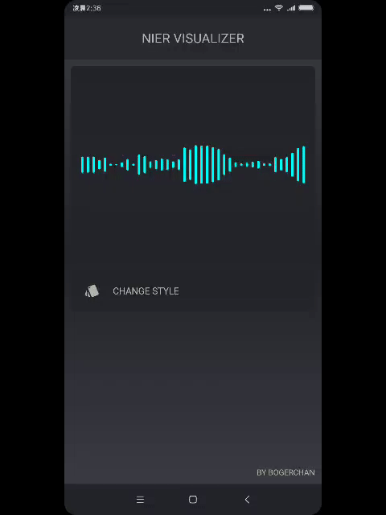
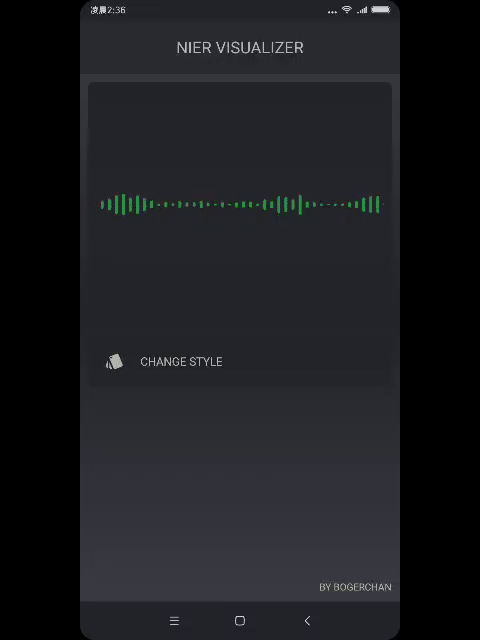
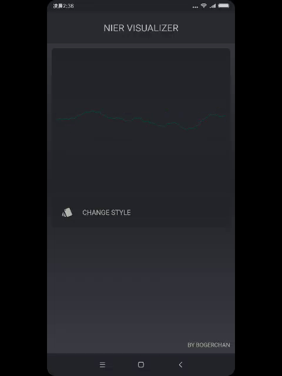
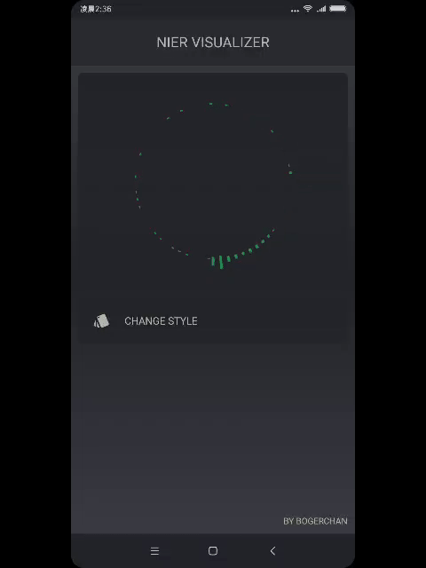
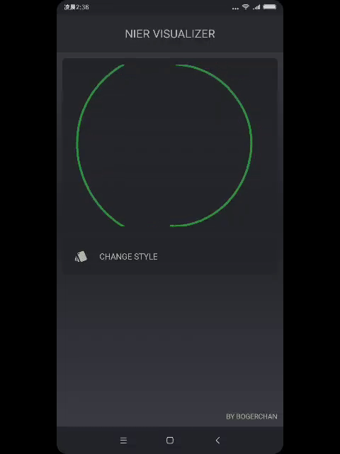
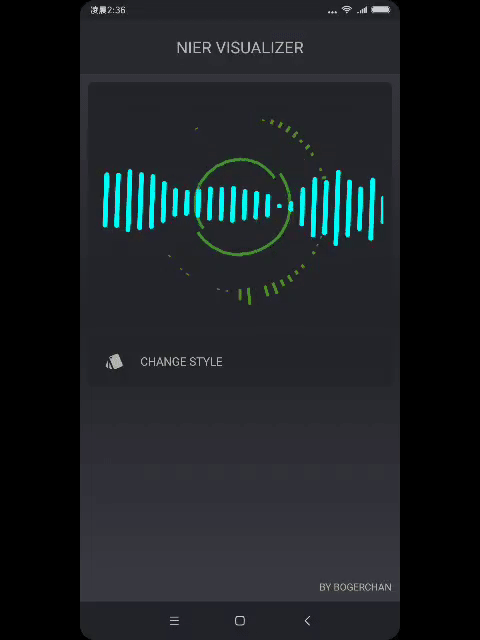
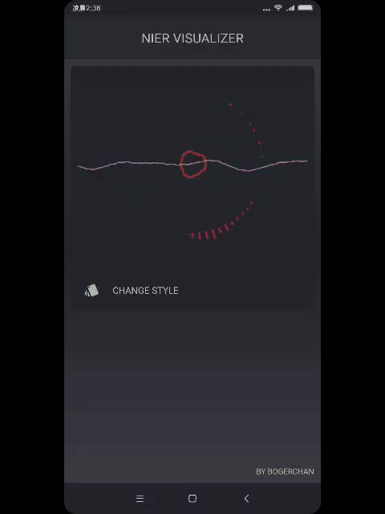
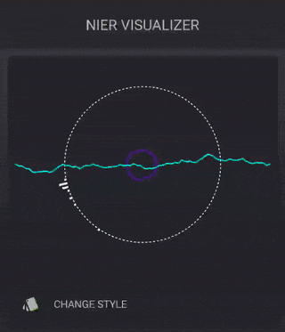
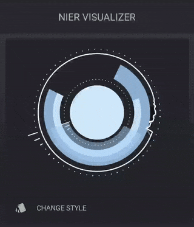

#### 语言切换: [English](README.md) / [中文](README-zh.md)

# 视觉效果

[](https://youtu.be/uxt-QJpYR3I)

> 请点击上面图片跳转播放。

# 1. Nier Visualizer 

Nier Visualizer 是一款纯 Kotlin 编写的轻量高效的 Android 可视化库，采用独立渲染线程，兼容绝大部分设备。适用于音频可视化的应用场景，如音乐播放器、录音应用、动态壁纸等。

> 目前已经有6种独立的可视化效果，更多效果开发中，欢迎 `start` 关注。

# 2. 效果图（不断更新中）

||||
|---|---|---|
||||
| ColumnarType1Renderer | ColumnarType2Renderer | ColumnarType3Renderer |
||||
| ColumnarType4Renderer(FFT) | LineRenderer | CircleBarRenderer |
||||
| CircleRenderer | 复合效果 1 | 复合效果 2 |
|| Star 本项目跟踪后续更新 |
| 复合效果 3 | 即将到来 |

# 3. 如何接入

## 3.1 依赖方式

1. 在项目根目录的 build.gradle 的 repositories 末尾加上该仓库：

```
allprojects {
		repositories {
			...
			maven { url 'https://jitpack.io' }
		}
	}
```

2. 添加下列依赖：

```
dependencies {
		compile 'com.github.bogerchan:Nier-Visualizer:v0.1.1'
	}
```

> 注意：由于 Visualizer 记录声音波形需要权限 `android.permission.RECORD_AUDIO`，请务必在项目中声明它。

## 3.2 项目实践

项目的 `demo` 模块可供接入参考。

## 3.3 Kotlin 接入

### 3.3.1 初始化框架

``` kotlin
val visualizerManager = NierVisualizerManager()

// 传入 audioSession, 0 为 output mix, AudioRecord 使用请参考 3.3.7
visualizerManager.init(0)
```

### 3.3.2 销毁框架实例，释放资源

``` kotlin
visualizerManager.release()
```

### 3.3.3 启动渲染

``` kotlin
visualizerManager.start(surfaceView, arrayOf(ColumnarType1Renderer()))
```

### 3.3.4 停止渲染

``` kotlin
visualizerManager.stop()
```

### 3.3.5 暂停渲染

``` kotlin
visualizerManager.pause()
```

### 3.3.6 恢复渲染

``` kotlin
visualizerManager.resume()
```

### 3.3.7 初始化框架 (使用外部数据源)

``` kotlin
val visualizerManager = NierVisualizerManager()

visualizerManager.init(object : NierVisualizerManager.NVDataSource {

                        // 略过无关代码...

                        /**
                         * 告诉 NierVisualzier 采样的时间间隔, 即间隔多久获取一次数据
                         * @return 采样数据间隔值，以毫秒为单位
                         */
                        override fun getDataSamplingInterval() = 0L

                         /**
                         * 告诉 NierVisualzier 返回字节数据的大小
                         * @return fft 和 wave 将返回的数组长度, fft 和 wave 两者数组长度必须保持一致
                         */
                        override fun getDataLength() = mBuffer.size

                         /**
                         * 提供 NierVisualzier 渲染所需要的 fft 数据
                         * @return fft 数据, 返回 null 则表示不进行 fft 相关数据渲染
                         */
                        override fun fetchFftData(): ByteArray? {
                            return null
                        }

                        /**
                         * 提供 NierVisualzier 渲染所需要的 wave 数据
                         * @return wave 数据, 返回 null 则表示不进行 wave 相关数据渲染
                         */
                        override fun fetchWaveData(): ByteArray? {
                            // 略过无关代码...
                            return mBuffer
                        }

                    })
```

## 3.4 Java 接入

### 3.4.1 初始化框架

``` java
NierVisualizerManager visualizerManager = new NierVisualizerManager();

// 传入 audioSession, 0 为 output mix, AudioRecord 使用请参考 3.4.7
visualizerManager.init(0);
```

### 3.4.2 销毁框架实例，释放资源

``` java
visualizerManager.release();
```

### 3.4.3 启动渲染

``` java
visualizerManager.start(surfaceView, new IRenderer[]{new LineRenderer(true)});
```

### 3.4.4 停止渲染

``` java
visualizerManager.stop();
```

### 3.4.5 暂停渲染

``` java
visualizerManager.pause();
```

### 3.4.6 恢复渲染

``` java
visualizerManager.resume();
```

### 3.4.7 初始化框架 (使用外部数据源)

``` java
NierVisualizerManager visualizerManager = new NierVisualizerManager();

visualizerManager.init(new NierVisualizerManager.NVDataSource() {

    // 略过无关代码...

    /**
     * 告诉 NierVisualzier 采样的时间间隔, 即间隔多久获取一次数据
     * @return 采样数据间隔值，以毫秒为单位
     */
    @Override
    public long getDataSamplingInterval() {
        return 0L;
    }

    /**
     * 告诉 NierVisualzier 返回字节数据的大小
     * @return fft 和 wave 将返回的数组长度, fft 和 wave 两者数组长度必须保持一致
     */
    @Override
    public int getDataLength() {
        return mBuffer.length;
    }

    /**
     * 提供 NierVisualzier 渲染所需要的 fft 数据
     * @return fft 数据, 返回 null 则表示不进行 fft 相关数据渲染
     */
    @Nullable
    @Override
    public byte[] fetchFftData() {
        return null;
    }

    /**
     * 提供 NierVisualzier 渲染所需要的 wave 数据
     * @return wave 数据, 返回 null 则表示不进行 wave 相关数据渲染
     */
    @Nullable
    @Override
    public byte[] fetchWaveData() {
        // skip some code...
        return mBuffer;
    }
});
```

# 4. 后续计划

- 类似 Siri 的可视化效果，构思中...
- 为 DJ 音乐定制的可视化效果库
- 如果你有兴趣，欢迎 Fork 一起搞

# 5. 致谢

部分效果参考 [android-visualizer](https://github.com/felixpalmer/android-visualizer)，感谢 `felixpalmer` ！

# 6. 开放协议

```
Copyright 2018 Boger Chan

Licensed under the Apache License, Version 2.0 (the "License");
you may not use this file except in compliance with the License.
You may obtain a copy of the License at

   http://www.apache.org/licenses/LICENSE-2.0

Unless required by applicable law or agreed to in writing, software
distributed under the License is distributed on an "AS IS" BASIS,
WITHOUT WARRANTIES OR CONDITIONS OF ANY KIND, either express or implied.
See the License for the specific language governing permissions and
limitations under the License.
```